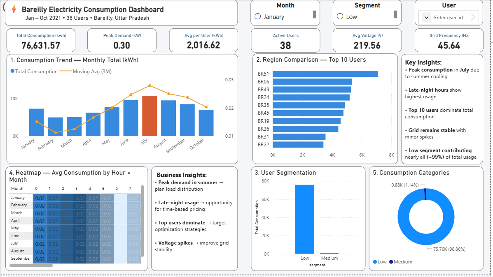

# ⚡ Bareilly Electricity Consumption Dashboard (EDA Project)


---

## 🚀 Project Overview

This project presents an end-to-end **Exploratory Data Analysis (EDA)** and an **interactive Power BI dashboard** built using smart meter data from Bareilly, Uttar Pradesh, India.

The dataset contains approximately **3.9 million time-stamped electricity readings** from **38 smart meters**, enabling deep insights into consumption patterns, peak demand, and grid performance.

---

## 🎯 Problem Statement

Electricity distribution systems require efficient monitoring and analysis to:

* Optimize energy usage
* Identify peak demand periods
* Detect anomalies in grid behavior

This project aims to provide **data-driven insights** into electricity consumption to support better decision-making.

---

## 🧠 Technologies Used

* Python (Pandas, NumPy)
* SQL
* Power BI

### Core Concepts

* Exploratory Data Analysis
* Time Series Analysis
* Data Visualization

---

## 📂 Project Structure

```id="2nq6vi"
electricity-project/
│
├── data/
│   ├── Bareilly_2021.csv
│   └── cleaned_bareilly_data.csv
│
├── sql/
│   └── electricity_analysis.sql
│
├── pandas/
│   └── electricity_analysis.py
│
├── powerbi/
│   └── dashboard.pbix
│
├── images/
│   └── dashboard.png
│
└── README.md
```

---

## 📊 Dashboard Preview



---

## 🧱 Dashboard Components

### 🔹 KPI Cards

* Total Consumption: **76,631.57 kWh**
* Peak Demand: **0.30 kW**
* Average Consumption per User: **2,016.62 kWh**
* Active Users: **38**
* Average Voltage: **219.56 V**
* Grid Frequency: **45.64 Hz**

---

### 📈 Monthly Consumption Trend

* Combines bar chart with moving average
* Reveals seasonal usage patterns
* Peak consumption observed in **July**

---

### 📊 Top 10 Electricity Consumers

* Identifies high-usage users
* Helps target optimization strategies
* Example: **BR51** is the highest consumer

---

### 🔥 Heatmap (Hour × Month)

* Shows hourly consumption across months
* Highlights peak demand hours
* Useful for load balancing

---

### 👥 User Segmentation

* Categorized into Low and Medium usage
* Majority fall under **Low consumption**
* Indicates uneven usage distribution

---

### 🍩 Consumption Distribution

* Donut chart showing segment contribution
* Low consumption users contribute ~99%
* Highlights consumption imbalance

---

## ⚙️ How It Works

1. **Data Collection**

   * Smart meter readings collected over time

2. **Data Cleaning**

   * Handling missing values
   * Formatting timestamps
   * Removing inconsistencies

3. **Data Analysis**

   * Aggregation using SQL & Pandas
   * Trend and pattern extraction

4. **Visualization**

   * Dashboard built using Power BI
   * Interactive filters and insights

---

## 🧠 Key Insights

* Electricity consumption shows clear **seasonal trends**
* Peak demand occurs during specific **hours of the day**
* A small group of users contributes **disproportionately high usage**
* Majority of users have **low consumption behavior**
* Grid voltage remains stable, but **frequency fluctuations observed**

---

## 📊 Use Cases

* Energy demand forecasting
* Load balancing and peak management
* Smart grid optimization
* Policy and infrastructure planning

---

## ⚠️ Limitations

* Limited number of users (38 meters)
* Data restricted to a single region
* No real-time streaming data

---

## 🔥 Future Improvements

* Time-series forecasting using ARIMA / Prophet
* Anomaly detection in consumption patterns
* Cost and billing analytics
* Real-time dashboard integration

---

## 🌐 Deployment

This project can be extended into:

* Power BI Online dashboard
* Embedded analytics platform
* Real-time monitoring system

---

## 👨‍💻 Author

**Amol Rathod**

---

## ⭐ Acknowledgements

* Smart meter dataset
* Power BI community
* Python data analysis ecosystem

---

## 📌 Conclusion

This project demonstrates how large-scale electricity data can be transformed into meaningful insights using EDA and visualization tools.

It highlights:

* Data-driven decision-making
* Real-world analytics workflow
* Practical dashboard development

---
